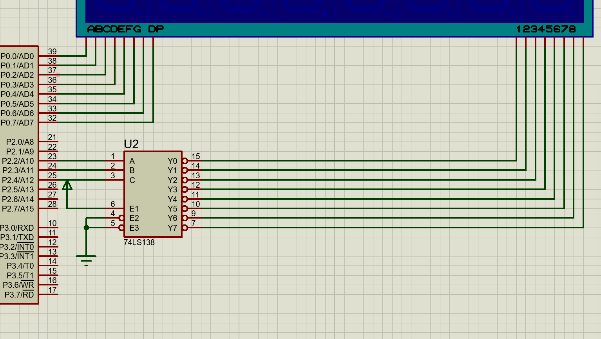
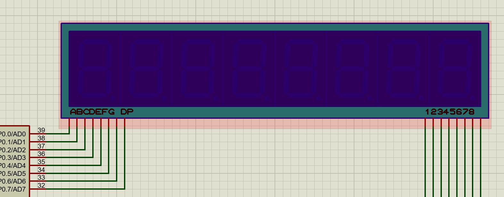
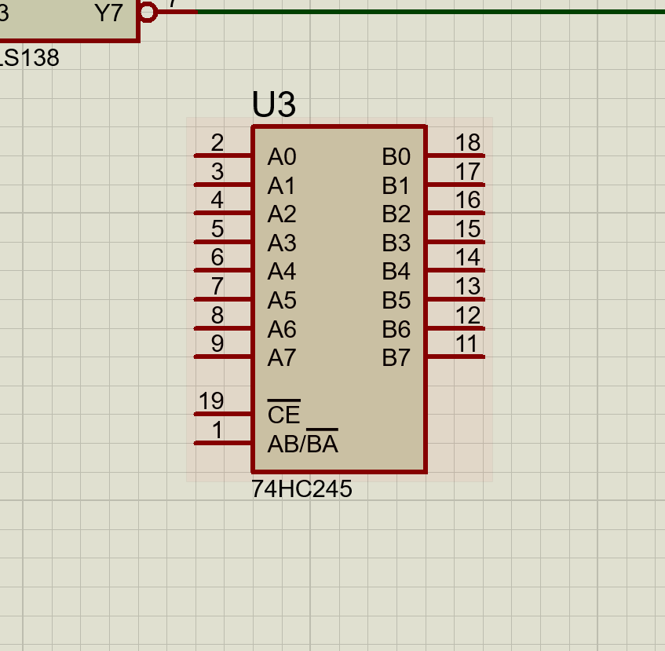

#### 分类
&nbsp;&nbsp;&nbsp;&nbsp;数码管根据公共端所接的电平高低分为共阴和共阳两种数码管。当公共端接阳极时，想要点亮对应的线就要对其对应的端口置低电平操作，相反，对接阴极想要亮的电平也相反。

仿真名称：共阳（常用）7SEG-MPX8-ANODE；共阴 7SEG-MPX8-CATHODE
#### 组件
&nbsp;&nbsp;&nbsp;&nbsp;八位数码管实际上是由74HC138译码器，八位数码管以及74HC245组成的，下面将配合信号传导讲解三个原件。

在程序导入后，首先进行位选（选择8个数码管的哪一个），再进行段选。
位选即通过138译码器进行工作，如图示：

基础配置为E1置高电平，E23都置低电平，完成配置后就是进行译码位选。
可以看到图中与单片机引脚相接的有ABC三个引脚，对输出的二进制编码以CBA这样排列，翻译为十进制对应0~7，对应过去就是1~8 8个数码管。另外，如果右边引脚编号头上有横线代表低电平有效，即如果选到哪一位哪一位的电平就会被拉低。

在位选结束后，接下来的是段选，即选定要哪段数码管发光。

在图中可见，无论是共阴还是共阳，他们的com端（公共端）都是已经内部接好的，剩下的只有段选的问题，由于单片机的引脚基本为弱上拉模式，电流较小，如果不进行放大很容易检查失误，那么就用到74HC245.

上面八对对应引脚不用说，是单片机引脚和段选引脚的接口，下面CE与AB/BA作用如下：

CE，即chip enable，代表使能，上面加一条横线代表低电平有效，高点平进入高阻态，相当于断路，作用是总线隔离保护，当数码管短路时保护单片机内部不被烧坏
AB/BA，控制数据传输方向，看图，A→B高点平，相反电平也相反。

作用讲解：
1.增强驱动，74HC245内部为推挽输出，电流大而且稳定；
2.总线保护
3.电源适配

ps：做小项目时，可以考虑数码管短路情况，利用自恢复保险丝和三极管检测电流，如果电流过高自动拉高电平，74HC245处于高阻态，修复后回到低电平还可以继续工作。
