### 定时器
#### 简介
作为单片机的外设，51单片机一般配置有两个定时器（T0,T1），两个定时器都为16位定时器，本质上是对脉冲进行计数，分为计时与计数两种工作模式。在计数内部时钟时，其频率确定，起的是计时作用，每6个或12个时钟获得一次计时脉冲，代表过了0.5us或1ms；当计时脉冲来自外部定时器时（0/1→3.4/3.5）为计数模式，一次脉冲记1。

定时器有有0(13位)1(16位)2(八位自动重装器)3(8+8)四种工作模式，特别的，在三模式下定时器1只能做波特率发生器使用。

#### 相关寄存器
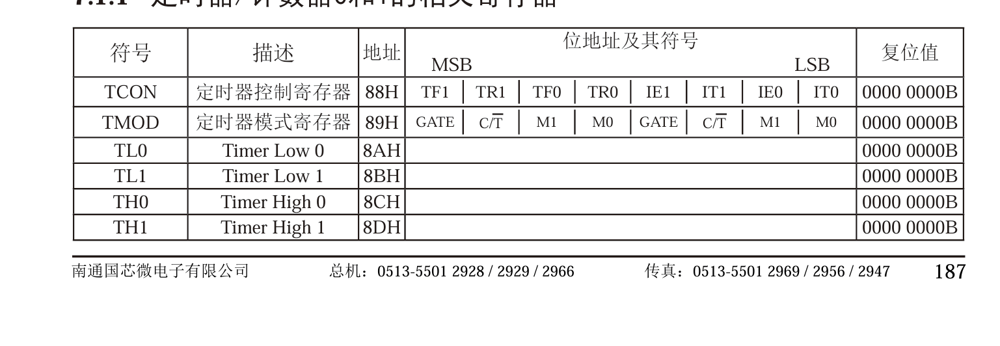
##### 控制寄存器TCON

TCON隶属于SFR（特殊功能寄存器），主要功能为两个定时器的控制寄存器，但也存在两种位锁存定时器溢出中断源与外部请求中断源，两种位如下：
一、TF/TR
TF为Timer overflow flag，定时器溢出标志，当达到最高位时，计时器停止计数，TF置1，向MCU发送中断，直至被处理，才被硬件清0（电路自主操作）
TR为Timer Run Control bit，为运行控制位，当gate为0时，TR为1就可以计数，gate为1时，同时满足TR-1与INT1为高电平才可以（需要注意，这里由软件置一，所以要手动操作）
二、IE/IT
IE为外部中断请求源，E可以当作enable处理，当其为1时，发送请求，处理后自动为0
IT作为外部中断触发方式控制位，当其为0时，只有INT0（P3.2）为0时才能触发中断（需要手动清电平），而置高位时，检测到下降沿马上触发
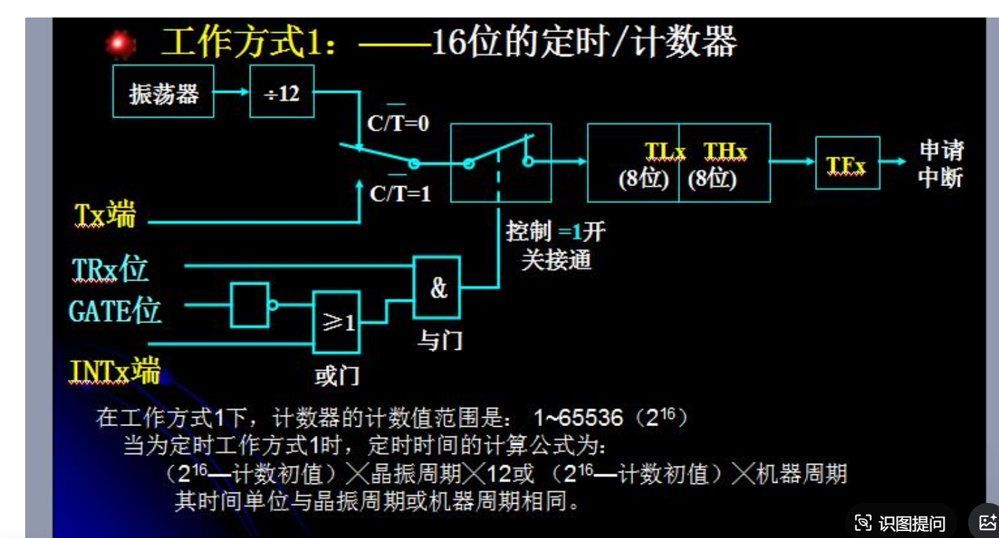
TCON的格式如下：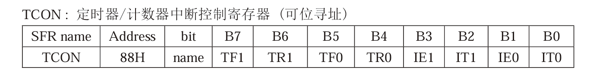
看图得，地址为0x88（H为16进制），bit为地址，name为对应地址存储数的名。

##### 模式控制寄存器TMOD
TMOD的格式如下，下面将讲解各个位与作用。
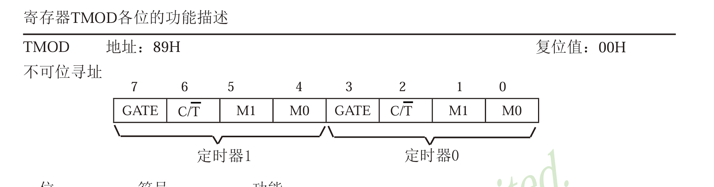
tmod共八位，T1,T0各占四位，各位的作用如下：
1. GATE（门）：该门置一时，需要TR与INT一同置一才能开启定时器，该位置0时，TR为1开启计时器。
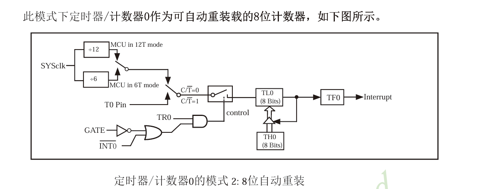
2. C/T：看头上的标记，高电平做计数器（count，外部输入），低电平做计时器（Time）
3. M1/M0：模式选择位，M1在前，M0在后。00最小，11最大。
#### 工作模式
定时器有四种工作模式，其中模式3的两个定时器情况不一样，后面讲
1. 工作模式0（13位定时器）
该模式有TL0的五位与TH0的8位组成，前五位溢出后向TH0进位，因此又叫32分频定时器。如下图所示：
1. 工作模式1（16位定时器）
该模式同时用到TH与TL共16位，TL溢出后向TH进位
1. 工作模式2（八位自动重装模式）
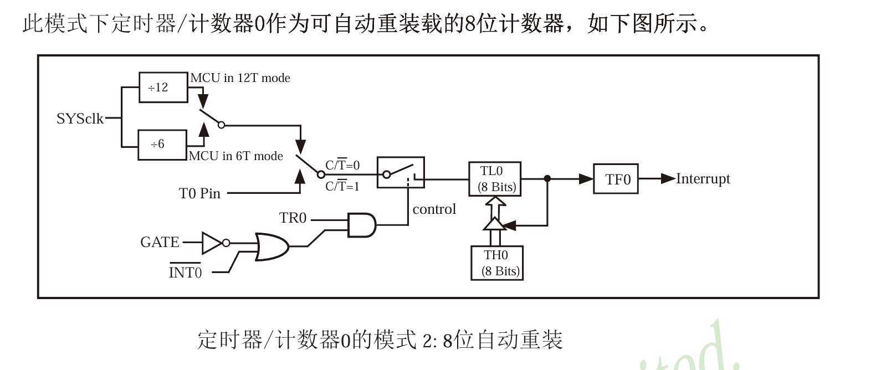
由图可见，TH在设置同一初值后，在TL溢出后，中断信号发出，TH复制给TL，再从初值开始计时。
1. 工作模式3（两个八位计时器）
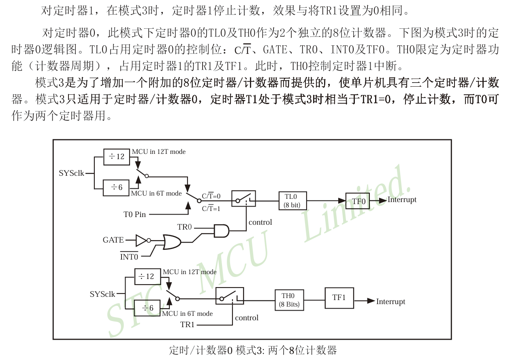
该模式中，定时器1没有定时作用，其TF1被TH0占据，定时器0可以当成两个寄存器来看。
### 中断
中断结构
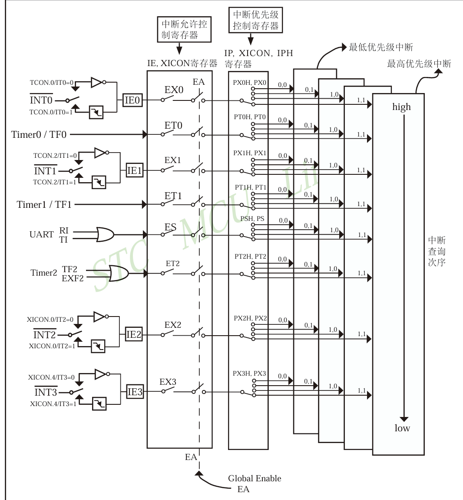
一个完整的中断由中断源，中断优先级，中断触发方式，中断处理和外部中断组成。
下面将逐个讲解：
#### 中断源
单片机的中断来源可分为外部与内部，再在该范围进行细分。以下是内外来源的触发方式。可见，外部中断基本有两种触发方式，内部的触发方式略有不同。
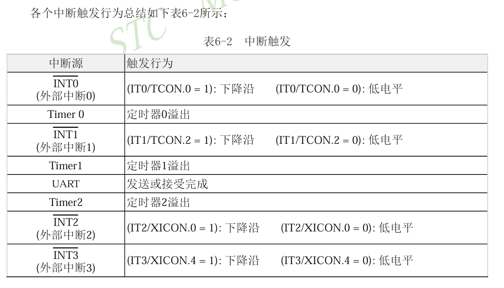
#### 中断寄存器
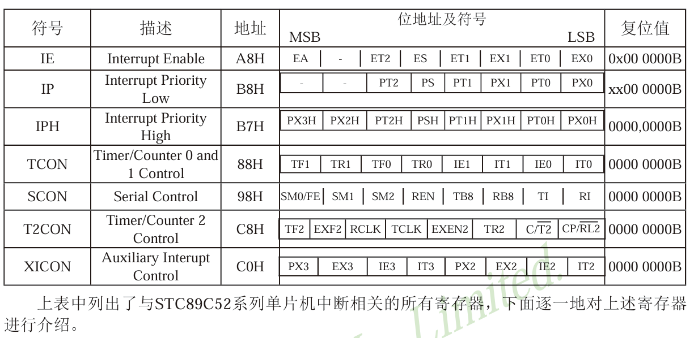
下面将讲解各类寄存器
##### 中断允许寄存器（IE）与XICON（辅助控制寄存器）
中断允许寄存器控制定时器，串口与0/1两个外部中断，其格式位总中断控制位与各个中断的中断允许位（允许开启中断）组成。
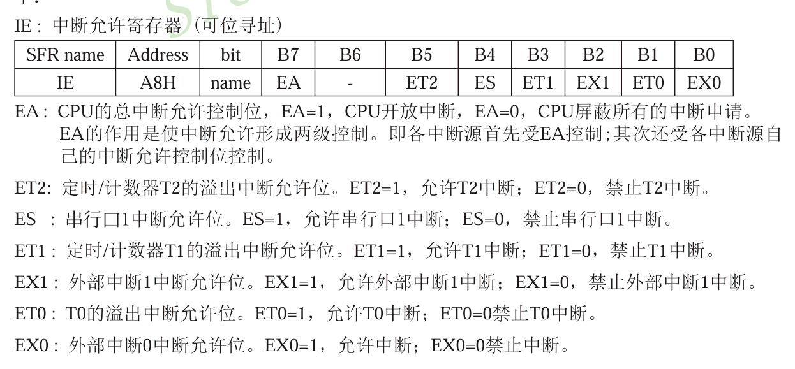
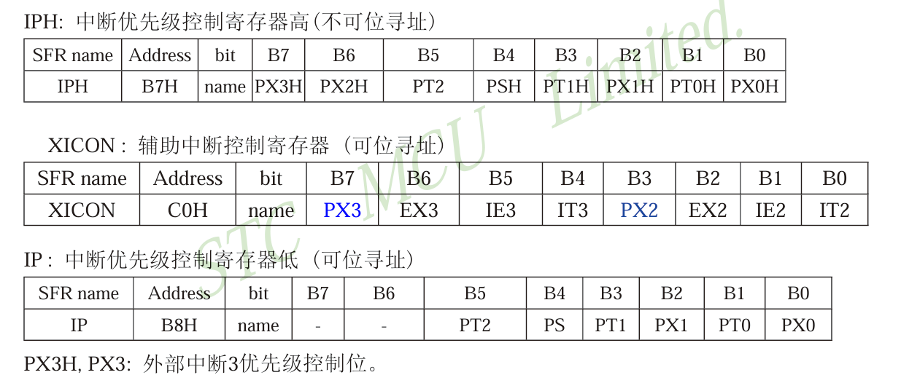
XICON是辅助控制寄存器，专门用来控制拓展的两个外部中断2/3.包括了中断使能（EX），中断源类型选择位(IT)（低电平触发/下降沿触发）优先级(PX)以及中断请求标志位状态（IE）
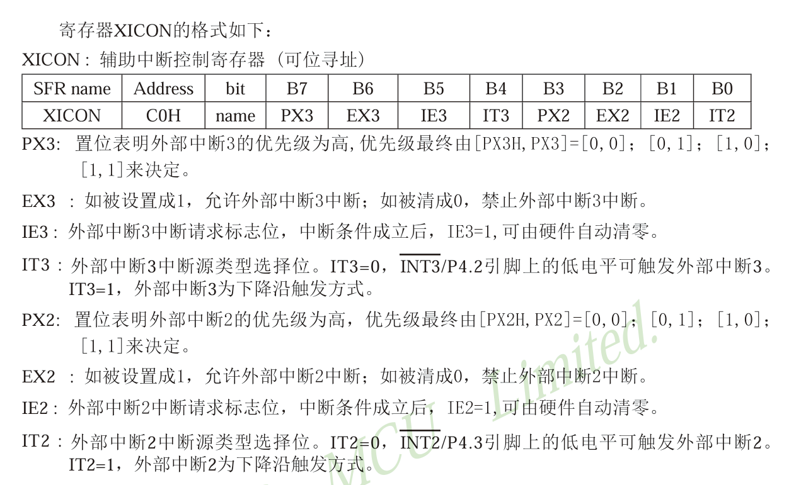
##### 中断优先级控制寄存器IP/IPH/XICON
中断嵌套的两个原则——1. 高等级插入低等级；2.同等级不打断
中断优先级判断——同一时间两个优先级相同的中断发生时，一依据终端查询次序判断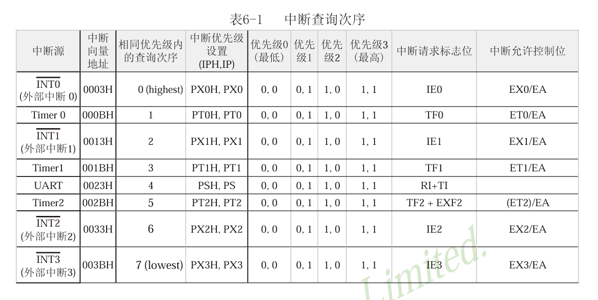
中断等级有2阶与4阶两种，看需不需要IPH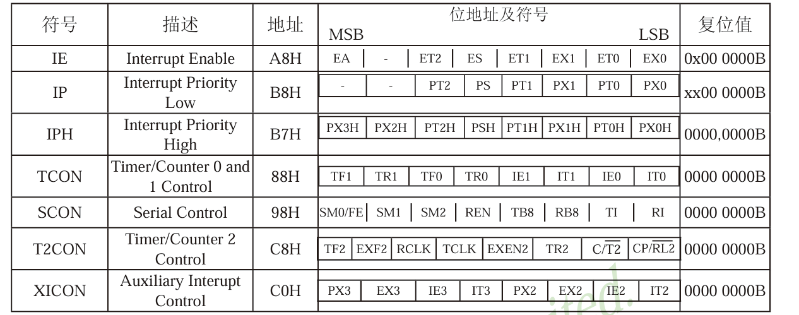
判断的话H为高位无H为低位，如下例：
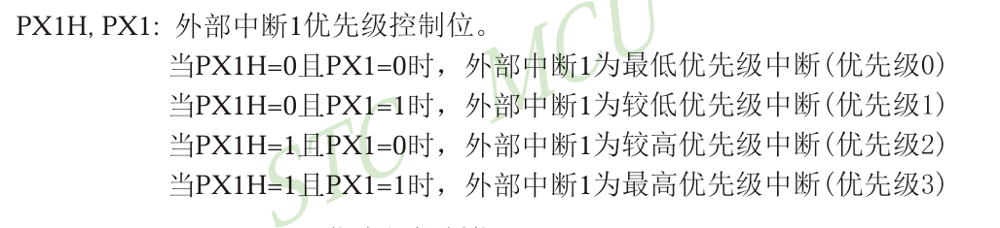
当中断源优先级相同时，按中断优先辅助查询控制器查找
##### 中断处理
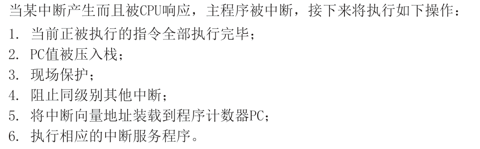
中断处理共6步，下面将详细讲解各部流程
第一步：执行完成当前指令
中断信号来后，CPU会执行完现在的指令在响应中断。
第二步：PC入栈
PC值存储下一条要执行的指令地址，压入栈中，中断结束后恢复PC值。
第三部：现场保护
中断程序会用到各种寄存器，如果不保存主程序状态会被破坏，现场保护就是扎这些寄存器的值压入栈，结束后恢复。
第四步：阻止同级别其他中断
CPU为避免嵌套混乱，CPU会自动屏蔽小于等于同优先级的中断，在面对高优先级的中断，会在执行一次类似中断处理的流程
第五步：加载中断向量到PC
执行中断程序（ISR），要求短小精悍
第六步：还原环境
将之前堆积的PC与寄存器弹出，恢复原来状态，经历RET1/RET指令后回去

RET1与RET区别：是否释放中断阻塞，RET1会主动清除中断优先级触发器，RET不会，
中断优先级触发器：响应中断时会主动置位中断优先级触发器，屏蔽同级中断。

#### 代码实操
##### 一、利用定时器制作较少占据CPU运行的按键控制LED。
一般的按键扫描利用while循环查询按键状态，CPU一直空转，资源利用率低，定时器中断可以有效避免CPU空转，降低CPU占用。
程序目的：利用定时器，0.5秒检测一次模式状态，在中断中调整模式。
利用模块化编程，可将代码分为定时器初始化，按钮初始化，delay函数三个模块与主函数。
如下：
定时器初始化，使用模式零到三都可以，这里用模式三，然后就是中断函数书写，在定时器函数后加interrupt n，表示中断，n对应的数如下
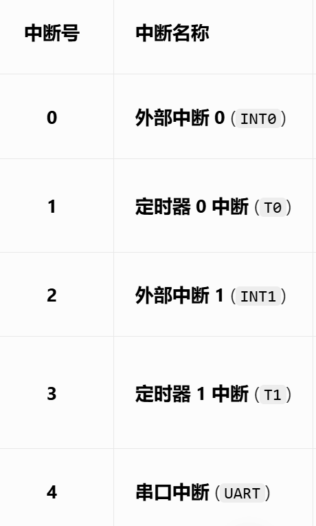
现在用定时器0的模式二（八位自动重装）来写定时器代码
需要先知道一件事：定时时间=（最大值-初值）*机器周期，机器周期看单片机的频率，12MHZ的是1US，6的是2。
然后对于十六进制，大于256的值要用TH0与TL0表示，然后前四位存在TH0，后面为TL0，前面用初值除以256，后面用求余。

*这里需要讲一下位运算
&：按位与，对应位都为1时才为1，否则为0
|：按位或：对应位不同时为1，相同时为0
~：按位取反，1/0取反。
<<：左移，所有位同时向左移动n格，右边补0
’>>‘：和上边一样。
位运算可以用于TCON与TMOD的配置，由于TMOD不可以按位*

其次就是中断的EA,ET0置1，开启中断开关，可以出入中断
代码展示
定时器初始化代码：
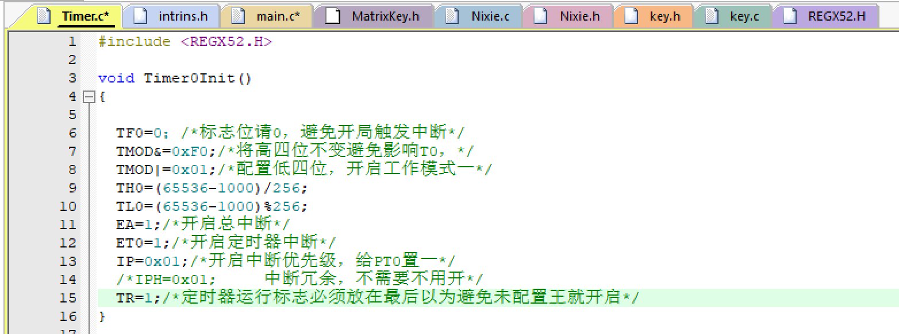
main函数：
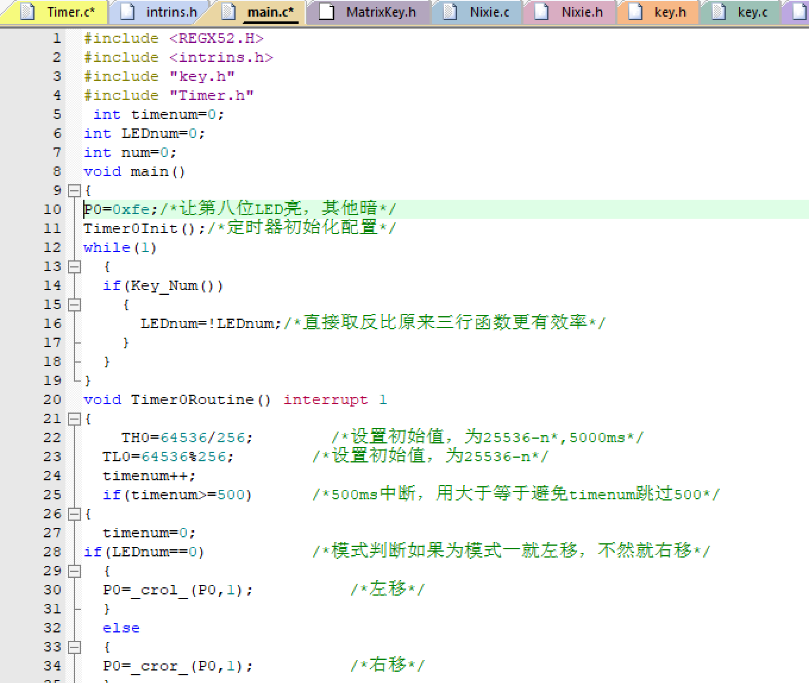
按键函数：
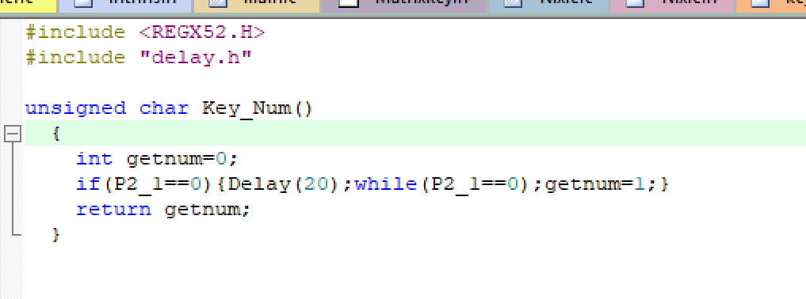
这是三个函数，他们的头文件自己应该可以看出来
##### 利用定时器制作时钟
还是用定时器零的模式一，然后设置目标值为1毫秒，检测到有1000个后加一秒，再有60秒清零加一分钟，这样循环到小时，在终端里面完成。

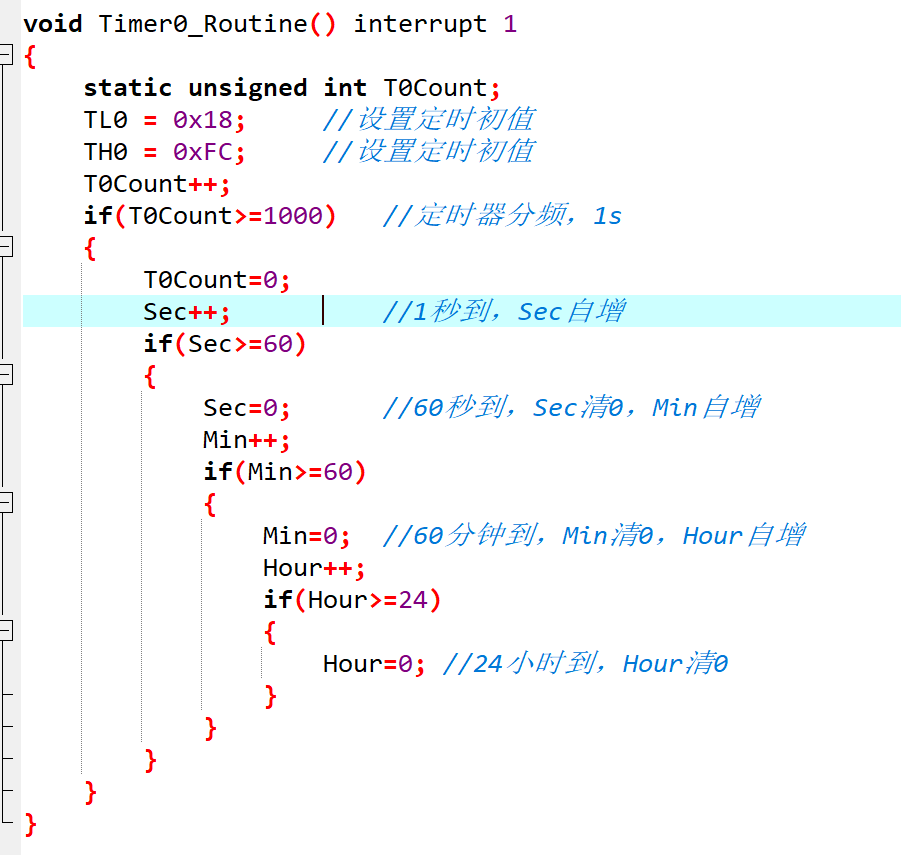