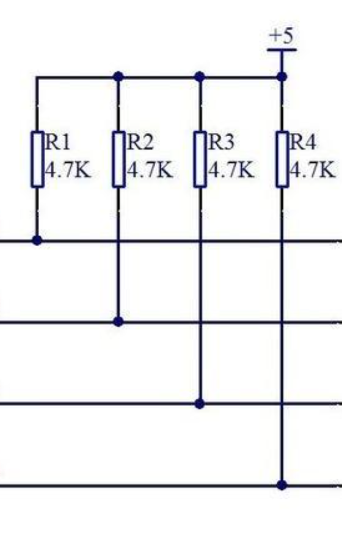

#### 概念介绍（STC89C51）
    单片机，简称MCU，集成了CPU,RAM,ROM,定时器，中断系统等，任务为信息采集，处理（CPU），硬件控制等
两种存储器：闪存RAM（512B）与ROM（8K）（存写程序）
区别：RAM掉电丢失，而ROM长期保存，所以要长期保存数据要用ROM
部分引脚介绍
单片机的引脚共40个，分为四大类：一、电源引脚VCC、GND  ；二、时钟引脚XTAL1与XTAL2，1进2出（时钟信号），
XTAL为晶振缩写；三、I/O引脚，分为0~3四组，每组0~7八个引脚，下面是一些详细说明：
  1.除P0口为开漏输出外，其他都是内部上拉（弱），对应的，P0电平是反复横跳的
  2.P3口有着第二功能
四、复位/控制引脚

#### 基本逻辑
    
单片机中，1代表高电平，0代表低电平，在程序初始配置中，需要将所有引脚电平置为高点平。还有
