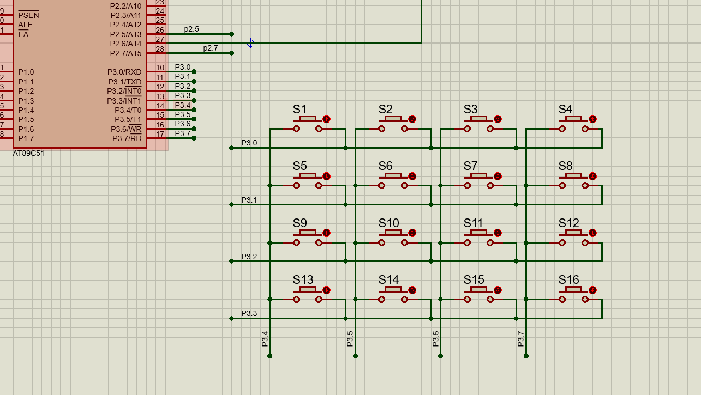
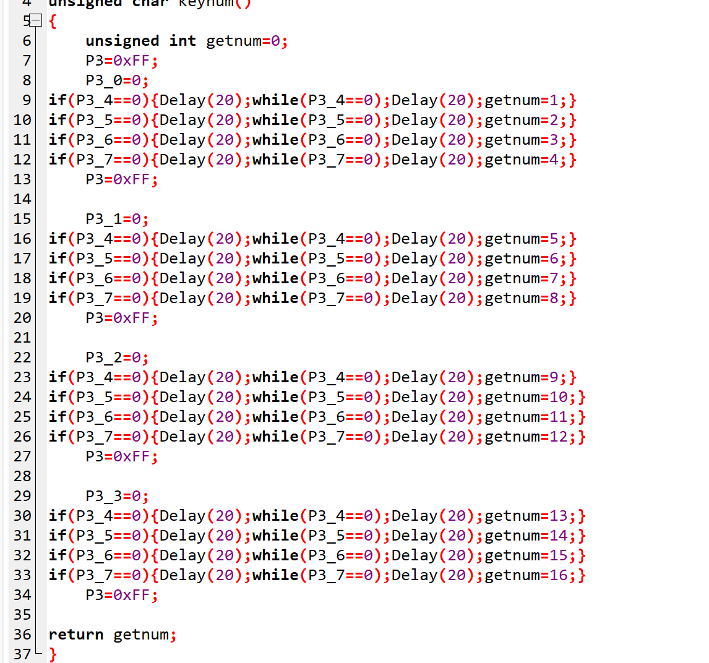
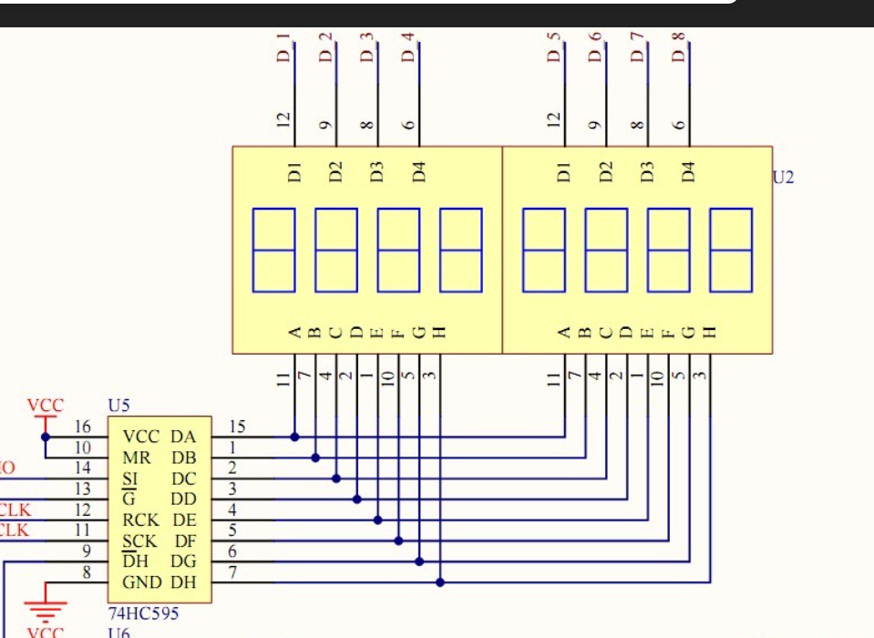
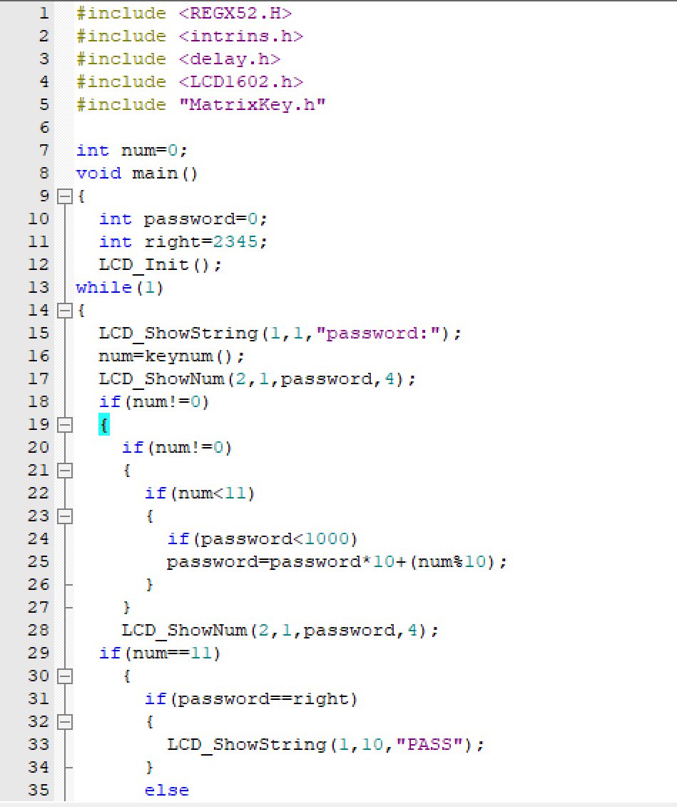
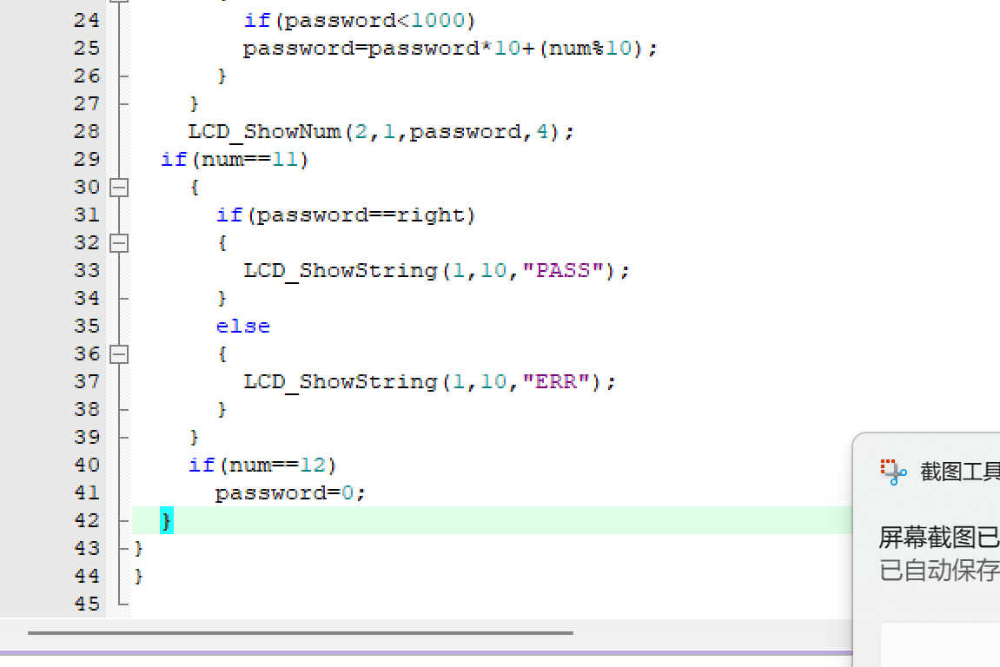

#### 矩阵键盘接线图

由图可见，接法为行列式扫描接法，就是先对某四位电平逐一置不低电平，扫描剩下四位的电平变化，然后就可以确定到底是按下了那个按键，然后对应输出数字可以自己设。

如图所示，就是逐行置0，然后检测对应的电平，每一列都对应一个按键，这样就节约了8个接口，这种扫描方法也用在八位数码管的检测中

代码要点讲解：
矩阵键盘封装了三个函数——延时函数，键盘的按钮接收函数，LCD1602的函数。其中本节要点是按钮接收函数。要点如下：

1.在某一行电平置0并且扫描完毕后需要对P3的全部引脚置1处理，以保证初始条件相同。
2.本函数一次只能同时检测一个按键，若多个按键一起按下结果难说
**3.按键按下后要安排延时函数在二次检测前后的原因：消抖，在按钮按下时，里面的弹簧并不是一下子就按下去不动，而是会进行多次抖动，若没有延时函数，一次检测直接运行函数，可能在这一次检测中就传递出多次信号，二次的while是保证按钮已经恢复原状，再加延时还是消抖。**

小应用——密码锁

程序思路：

程序的目标如下——有完整的数字输入，确定，删除按钮；有完整的密码判定，确保密码正确；有完整的数字转密码，数字删除功能

如下：对于读取到的数字可以限定有用的按键，按其他不管，然后1到10读取，读取完的数字导入给password，再用乘法搞就行。判定就用if==。